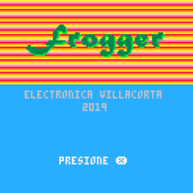
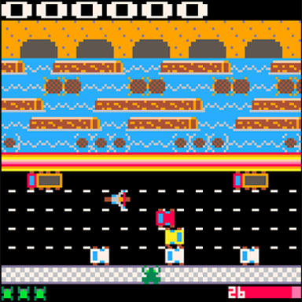

# PICO-8 Atari Frogger Clone

## 📸 Capturas de Pantalla

Un clon fiel y optimizado del clásico juego **Frogger de Atari (1981)**, desarrollado para la consola de fantasía **PICO-8** utilizando **Lua**.

🎮 [HAZ CLIC AQUÍ PARA JUGAR DESDE TU NAVEGADOR](https://electronicajlv.github.io/pico8-frogger/game.html)

## 🛠️ Características y Retos Técnicos Solucionados
* **Gestión de Carriles e Instancias:** Programación de un sistema de bucles para controlar múltiples objetos en movimiento (autos y troncos) organizados en carriles independientes con direcciones y velocidades variables.
* **Mecánica de Transporte (Río):** Implementación de lógica de colisiones avanzada para que el personaje adopte la velocidad y dirección del tronco sobre el que está parado, evitando que caiga al agua.
* **Control de Bordes y Pantalla:** Configuración de límites de mapa para evitar que la rana salga del área de juego y control de reaparición (*respawn*) al perder una vida.
* **Optimización Retro:** Ajuste del código bajo las restricciones técnicas de PICO-8 (límite de tokens y paleta de colores) para recrear la estética y fluidez del juego original de Atari.

## 🚀 Cómo ejecutarlo localmente
1. Descarga el archivo `frogger.p8` (o el cartucho `.p8.png`).
2. Abre tu consola PICO-8.
3. Ejecuta el comando `load frogger.p8` y luego `run`.

## 🎮 Controles
* **Flechas de Dirección:** Mover a la rana (Arriba, Abajo, Izquierda, Derecha).
* **Z / X / Enter:** Reiniciar juego / Comenzar.

